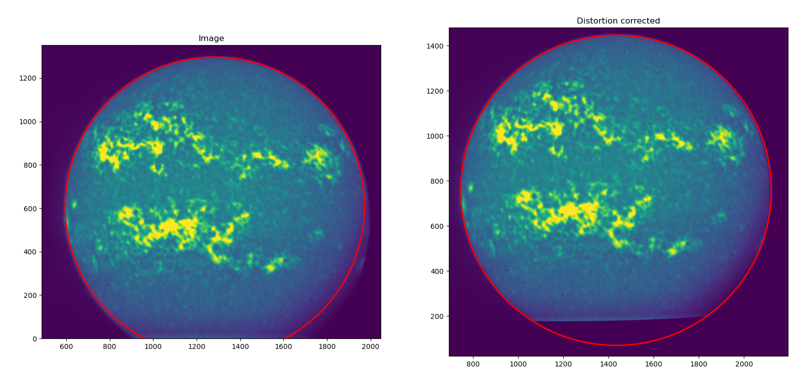

# SUIT ☀️🛰️ Distortion Correction
Correct distortion in SUIT images.

This module uses Zemax generated distortion profile, makes a distortion model for SUIT 2k and 4k images and applies the correction by pixel shifting method.

Distortion profile from ZEMAX is pushed with the repository.

## Usage
Prepare or follow this folder structure:
```
├── data
│   ├── external
│   │   ├── 2k_distortion_x_axis.fits
│   │   ├── 2k_distortion_y_axis.fits
│   │   ├── 4k_distortion_x_axis.fits
│   │   ├── 4k_distortion_y_axis.fits
│   │   └── distortion_100x100.txt
│   ├── interim
│   ├── processed
│   └── raw
├── products
├── README_files
│   └── screenshot_2024-08-18_21-53-18.png
├── README.md
├── reports
└── src
    ├── archive
    │   └── distortion_map_generator.py
    ├── distortion_batch_correction.py
    └── distortion_correction.py
```
You may make multiple folders as-
```
mkdir -p data/{raw,interim,processed,external}
```

## Screenshots




## Usage/Examples

### Distortion map generation
Run `distortion_correction.py` to generate 2k and 4k distortion maps. The maps are saved in `data/external`.

### Batch processing
Use `distortion_batch_correction.py` to batch process multiple images parelelly. Raw images or symlinks should be put in `data/raw`. Processed images will be saved in `processed/`

NOTE: This is a multiprocessing module, which might use all available cores based on workload.

## Authors

- [@janmejoysarkar](https://github.com/janmejoysarkar)

## Acknowledgements

 - [IUCAA, Pune](https://www.iucaa.in)
 - [ISRO, Aditya-L1](https://www.isro.gov.in/Aditya_L1.html)


